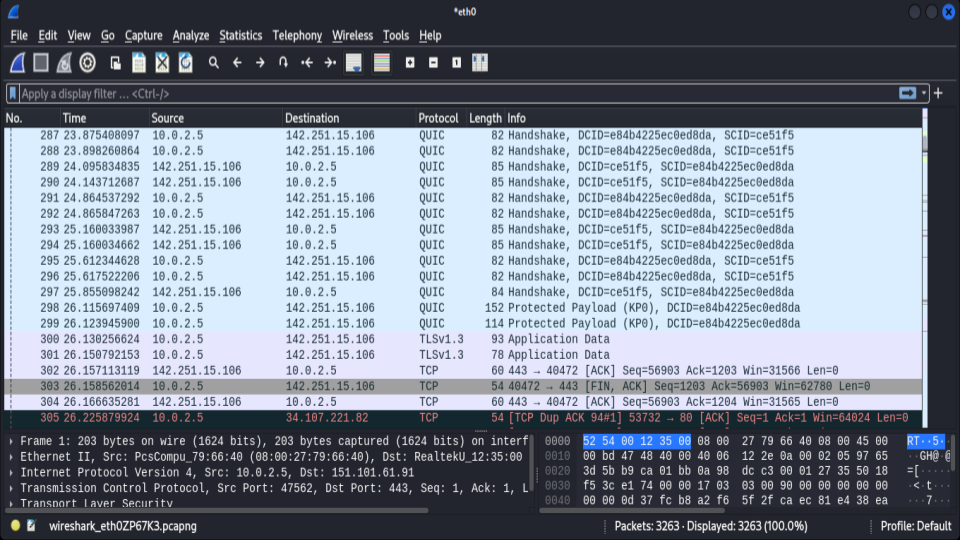
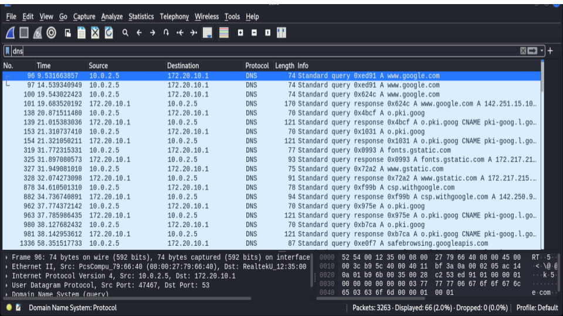
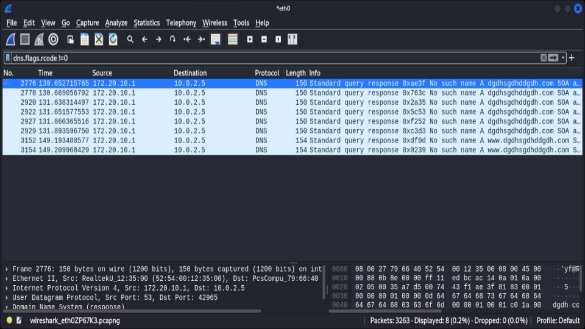

🔎 Wireshark Traffic Analysis Lab
📌 Overview

This lab demonstrates packet capture and traffic analysis using Wireshark. The objective was to analyze DNS queries, HTTPS encrypted traffic, and DNS error responses.

🛠 Tools Used

- Wireshark
- Kali Linux
- Google Slides (Documentation)

🔍 Analysis Breakdown
1️⃣ DNS Resolution

Observed DNS queries to resolve external domains

- Internal Host: 10.0.2.5
- DNS Server: 172.20.10.1
- Protocol: UDP Port 53

2️⃣ HTTPS Encrypted Traffic

- Identified TLS 1.3 encrypted application data
- Observed QUIC handshake
- TCP communication over port 443

3️⃣ DNS Error Detection

- Applied filter: dns.flags.rcode != 0
- Detected NXDOMAIN responses ("No such name")
- Demonstrated DNS failure analysis capability

### 📊 Evidence 

<h3 align="center">This image captures a live packet stream in Wireshark, highlighting the transition between different transport and application layer protocols</h3>

    

<h3 align="center">DNS Query and Response Mapping</h3>

    

<h3 align="center">This image demonstrates the use of advanced Wireshark display filters to identify network anomalies or resolution failures.</h3>

    

🔗 **Presentation Slides:**  
[Click here](https://docs.google.com/presentation/d/1xwrVbhw8hYEagOrL9yxzuhi4E-vTRG4RZMrsXJ4T-f8/edit?usp=sharing)

🛡️ Security Insight

Monitoring DNS failures and encrypted outbound traffic is essential in detecting suspicious activity such as domain generation algorithms (DGA) or abnormal network behavior.
